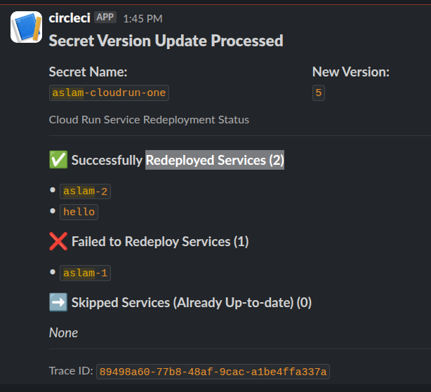

# 🔄 Run Secret Reloader

[](https://opensource.org/licenses/Apache-2.0)
[](https://golang.org/)
[](https://cloud.google.com/)

**Automatically redeploy Cloud Run services when secrets change in Google Secret Manager.**

Stop manual redeployments and let your services automatically pick up fresh secrets! This service listens for Secret Manager events and intelligently reloads only the Cloud Run services that depend on the updated secret.

## ✨ Features

- 🔄 **Automatic Redeployment** - No manual intervention needed
- 🏷️ **Label-based Targeting** - Only reloads services that depend on the changed secret
- 📦 **Zero Code Changes** - Works with existing applications using `os.Getenv()`
- 🔒 **Secure** - Uses OIDC authentication and proper IAM roles
- 📊 **Smart Versioning** - Skips redeployment if service already has newer secret version
- 🚨 **Slack Alerts (Optional)** - Get notified about successful/failed reloads with Trace ID for debugging
- 🌐 **Multi-service Support** - Handle multiple Cloud Run services per secret
- ☁️ **Serverless** - Runs as a Cloud Run service, scales to zero when idle

## 🚀 Quick Start

### 1. Deploy with Terraform

```hcl
module "reloader" {
  source     = "github.com/aslammmuhammed/run-secret-reloader//terraform/modules/reloader"
  project_id = "your-gcp-project-id"
  
  secrets = [
    "db-password",
    "api-key"
  ]
}
```

→ **[See complete deployment guide](./terraform/README.md)**

### 2. Label Your Services

Add labels to Cloud Run services that should reload when secrets change:

```bash
# For a service using "db-password" secret
SECRET_HASH=$(curl -X POST https://YOUR_RELOADER_URL/v1/hash \
  -H "Content-Type: application/json" \
  -d '{"secretName": "db-password"}' | jq -r '.secretNameHash')

gcloud run services update my-api-service \
  --region=us-central1 \
  --update-labels="run_secret_reloader-${SECRET_HASH}=true"
```

### 3. Update Your Secret

```bash
echo -n "new-password-value" | gcloud secrets versions add db-password --data-file=-
```

🎉 **That's it!** Your Cloud Run service will automatically redeploy with the new secret.

Cloud Run has built-in [secret hot-reload capabilities](https://medium.com/google-cloud/cloud-run-hot-reload-your-secret-manager-secrets-ff2c502df666), but most applications read secrets only once at startup. This project bridges that gap by automatically triggering redeployments when secrets change.

**The Problem:**
- Environment variables are read once at startup
- File mounts fetch fresh values, but apps cache secrets in memory
- Manual redeployments are error-prone and slow

**The Solution:**
- Automatic redeployments triggered by Secret Manager events
- Works with existing applications using `os.Getenv()`
- Label-based targeting ensures only dependent services reload

## 📋 How It Works

1. **Listen** - Service receives Secret Manager events via Pub/Sub
2. **Target** - Finds Cloud Run services with matching labels (`run_secret_reloader-<hash>=true`)
3. **Update** - Adds annotations to service template to force new revision
4. **Reload** - Cloud Run creates new revision with fresh secrets
5. **Alert (Optional)** - Sends Slack notification about success/failure status with Trace ID for error tracking

## 📦 Installation

### Option 1: Terraform (Recommended)

Deploy with our Terraform module that sets up all necessary infrastructure:

```hcl
module "reloader" {
  source     = "github.com/aslammmuhammed/run-secret-reloader//terraform/modules/reloader"
  project_id = "your-gcp-project-id"
  
  secrets = [
    "db-password",
    "api-key"
  ]
}
```

**📖 [Complete Terraform Documentation →](./terraform/README.md)**

### Option 2: Manual Deployment

For manual deployment or customization, see the [terraform directory](./terraform/) for infrastructure templates and configuration examples.

## 🔧 Configuration

| Variable | Description | Default | Environment Variable |
|----------|-------------|---------|---------------------|
| `http.port` | HTTP server port | `"8080"` | `HTTP_PORT` |
| `logger.log_level` | Log level | `"debug"` | `LOG_LEVEL` |
| `logger.log_format` | Log format (`console`/`json`) | `"json"` | `LOG_FORMAT` |
| `gcp.project_id` | GCP project ID | Required | `GOOGLE_CLOUD_PROJECT_ID` |
| `alert.provider` | Alert provider (`slack`/empty for no alerts) | `""` | `ALERT_PROVIDER` |
| `alert.slack.webhook_url` | Slack webhook URL (when using slack provider) | `""` | `SLACK_WEBHOOK_URL` |

Configuration can be set via YAML file (`config/config.yaml`) or environment variables.

### 📢 Slack Alerts (Optional)

Alerts are completely optional. When configured, the service sends Slack notifications about redeployment results, including a **Trace ID** for easy debugging and error tracking.

**Sample Alert:**



The alert includes:
- ✅ Successfully redeployed services
- ❌ Failed redeployments  
- ⏭️ Skipped services (already up-to-date)
- 🔍 **Trace ID** - Use this to search logs and debug issues

To enable alerts, set `ALERT_PROVIDER=slack` and `SLACK_WEBHOOK_URL` environment variables.

## 🎯 Usage

### Label Your Services

For any Cloud Run service that should reload when a secret changes:

```bash
# Get the hash for your secret name
SECRET_HASH=$(curl -X POST https://YOUR_RELOADER_URL/v1/hash \
  -H "Content-Type: application/json" \
  -d '{"secretName": "SECRET_NAME"}' | jq -r '.secretNameHash')

# Add the label to your service
gcloud run services update YOUR_SERVICE_NAME \
  --region=YOUR_REGION \
  --update-labels="run_secret_reloader-${SECRET_HASH}=true"
```

### Update Your Secret

```bash
echo -n "new-password-value" | gcloud secrets versions add db-password --data-file=-
```

### Monitor Progress

```bash
gcloud logs read "resource.type=cloud_run_revision AND resource.labels.service_name=run-secret-reloader" --limit=50
```

## 🛠️ API Reference

### Hash Endpoint

Compute the hash for a secret name:

```bash
POST /v1/hash
{
  "secretName": "my-secret-name"
}
```

**Response:**
```json
{
  "secretNameHash": "2dbfe2930811fa77b4fc5105492cc6e6"
}
```

### Health Check

```bash
GET /health
```

Returns service health status.

## 🏗️ Architecture & Technical Details

<details>
<summary>Click to expand technical details</summary>

### How It Works Internally

1. **Event Processing** - Receives Pub/Sub push notifications from Secret Manager
2. **Service Discovery** - Uses Cloud Run v1 API to list services with matching labels
3. **Template Updates** - Uses Cloud Run v2 API to update service annotations/labels
4. **Revision Creation** - Cloud Run automatically creates new revision when template changes

### Label and Annotation Schema

**Service Labels** (for targeting):
- `run_secret_reloader-<hash>=true` (where `<hash>` is MD5 of secret name)

**Template Annotations** (for tracking):
- `run_secret_reloader-<hash>/name` → secret name
- `run_secret_reloader-<hash>/version` → secret version

**Template Labels** (for tracking):  
- `run_secret_reloader-<hash>_version` → secret version

### Project Structure

```
cmd/app/                – program entrypoint
internal/               – application code
  app/                  – application initialization
  controller/           – HTTP handlers (webhook, health, hash)
  usecase/              – business logic (webhook processing)
  repo/                 – Cloud Run API client implementations
  dto/                  – data transfer objects
  utils/                – helpers (events, retry, secrets)
  constants/            – constants (retries, prefixes, errors)
  dependencies/         – dependency injection
  errors/               – custom error types
  middlewares/          – HTTP middlewares
pkg/                    – reusable packages
  alert/                – alerting providers (Slack, extensible)
  cloudrun/             – Cloud Run API client wrapper
  server/               – HTTP server implementation  
  logger/               – structured logging
config/                 – runtime configuration
terraform/              – infrastructure as code
```

### Error Handling & Retries

- **Retryable errors**: `ABORTED`, `OUT_OF_RANGE`, `FAILED_PRECONDITION`
- **Max retries**: 3 attempts with exponential backoff
- **Base delay**: 10 seconds between retries
- **Optimistic locking**: Uses etags to prevent conflicts

</details>

## 🤝 Contributing

Contributions are welcome! This project addresses limitations discussed in [Google Cloud Issue #197954279](https://issuetracker.google.com/issues/197954279).

### Development

```bash
# Clone the repository
git clone https://github.com/your-username/run-secret-reloader.git
cd run-secret-reloader

# Run locally
go run cmd/app/main.go

# Test webhook endpoint
curl -X POST http://localhost:8080/v1/webhook \
     -H "Content-Type: application/json" \
     -d @message.json
```

## 📜 License

Apache License 2.0 © 2025 Aslam Muhammed

---

Built with ❤️ for the Google Cloud community
