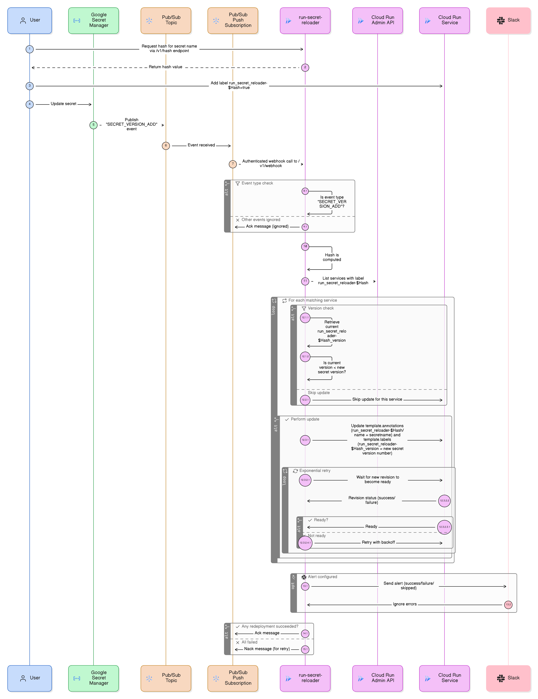

# 🔄 Run Secret Reloader

[](https://opensource.org/licenses/Apache-2.0)
[](https://golang.org/)
[](https://cloud.google.com/)

**Automatically redeploy Cloud Run services when secrets change in Google Secret Manager.**

Tired of manual redeployments when secrets change? This service automatically redeploys your Cloud Run services when their secrets are updated in Secret Manager. Built to address a highly requested feature - [automatic redeployment of Cloud Run services when dependent secrets change](https://issuetracker.google.com/issues/197954279).

## ✨ Features

- 🔄 **Automatic Redeployment** - No manual intervention needed
- 🏷️ **Label-based Targeting** - Only reloads services that depend on the changed secret
- 📦 **Zero Code Changes** - Works with existing applications using `os.Getenv()`
- 🔒 **Secure** - Uses OIDC authentication and proper IAM roles
- 📊 **Smart Versioning** - Skips redeployment if service already has newer secret version
- 🚨 **Alerts (Expandable)** - Receive notifications about successful or failed reloads, with Trace ID for debugging. Currently, only Slack is supported.
- 🌐 **Multi-service Support** - Handle multiple Cloud Run services per secret
- ☁️ **Serverless** - Runs as a Cloud Run service, scales to zero when idle


Cloud Run has built-in [secret hot-reload capabilities](https://cloud.google.com/run/docs/configuring/services/secrets) when secret is mounted as a volume instead of injecting, but most applications read secrets only once at startup. This project bridges that gap by automatically triggering redeployments when secrets change.

**The Problem:**
- Environment variables are read once at startup
- File mounts fetch fresh values, but apps cache secrets in memory
- Manual redeployments are error-prone and slow

**The Solution:**
- Automatic redeployments triggered by Secret Manager events
- Works with existing applications using `os.Getenv()`
- Label-based targeting ensures only dependent services reload
- Both volume mounting and secret injection methods work with this secret reloader when using 'latest' version (instead of pinned version numbers), Cloud Run automatically fetches the newest secret value when a new revision is deployed.

## 🚀 Quick Start

### 1. Deploy with Terraform

→ **[See complete deployment guide](./terraform/README.md)**

### 2. Label Your Services

Add the label to services that should reload when secrets change:

```bash
# For a service using "user-service-env" secret
SECRET_NAME_HASH=$(curl -X POST https://YOUR_RELOADER_URL/v1/hash \
  -H "Content-Type: application/json" \
  -d '{"secretName": "user-service-env"}' | jq -r '.secretNameHash')

# Add this label to your Cloud Run service to enable automatic redeployment
"run_secret_reloader-${SECRET_NAME_HASH}=true"

# To turn off the reloader, set the label to false
"run_secret_reloader-${SECRET_NAME_HASH}=false"
```

### 3. Update Your Secret

```bash
echo -n "new-password-value" | gcloud secrets versions add user-service-env --data-file=-
```

🎉 **That's it!** Your Cloud Run service will automatically redeploy with the new secret.

## 🛠️ API Reference

### Hash Endpoint

```bash
POST /v1/hash
{
  "secretName": "my-secret-name"
}
```

**Response:**
```json
{
  "secretNameHash": "2dbfe2930811fa77b4fc5105492cc6e6"
}
```

### Webhook Endpoint

```bash
POST /v1/webhook
```

### Health Endpoint

```bash
GET /health
```

## 🏗️ Architecture & Technical Details

### Error Handling & Retries in Cloud Run Redeployment

- **Retryable errors**: `ABORTED`, `OUT_OF_RANGE`, `FAILED_PRECONDITION`
- **Max retries**: 3 attempts with exponential backoff
- **Base delay**: 10 seconds between retries
- **Optimistic locking**: Uses etags to prevent conflicts in Cloud Run update

### How It Works Internally

1. **Event Processing** - Receives Pub/Sub push notifications from Secret Manager
2. **Service Discovery** - Uses Cloud Run v1 API to list services with matching labels
3. **Template Updates** - Uses Cloud Run v2 API to update service annotations/labels
4. **Revision Creation** - Cloud Run automatically creates new revision when template changes

### Label and Annotation Schema

**Service Labels** (for targeting, manually added by user):
- `run_secret_reloader-<secret_name_hash>=true` (where `<secret_name_hash>` is MD5 of secret name)

**Template Annotations** (for tracking, automatically managed by application):
- `run_secret_reloader-<secret_name_hash>/name` → Maps hash back to original secret name for better readability
- `run_secret_reloader-<secret_name_hash>/version` → secret version

**Template Labels** (for tracking, automatically managed by application):
- `run_secret_reloader-<secret_name_hash>_version` → secret version

### Architecture Diagram


### FAQ

#### 1. Why are labels used for service discovery?
Labels are used because the Cloud Run Admin API supports efficient, server-side filtering based on them. This allows the reloader to quickly identify only the relevant services that need redeployment without having to list all services and filter them on the client-side, which is more scalable and performant.

#### 2. Why is the secret name hashed in the label?
Cloud Run labels have strict character restrictions (they must contain only lowercase letters, numbers, underscores, and dashes). Hashing the secret name (using MD5) ensures a consistent and valid label key, regardless of the characters in the original secret name. For readability, the original secret name is stored back in the service's template annotations.

#### 3. How does updating the template trigger a redeployment?
Cloud Run automatically creates a new service revision only when its template is modified. Changes to service-level metadata (like top-level labels or descriptions) do not trigger a redeployment. This reloader works by making a small, benign change to the template's annotations, which forces Cloud Run to create a new revision. This new revision then starts up with the latest version of the secret. An alternative is planned in issue https://github.com/aslammmuhammed/run-secret-reloader/issues/13 .

### Project Structure

```
cmd/app/                – program entrypoint
internal/               – application code
  app/                  – application initialization
  controller/           – HTTP handlers (webhook, health, hash)
  usecase/              – application logic (webhook processing)
  repo/                 – Cloud Run API client implementations
  dto/                  – data transfer objects
  utils/                – helpers (events, retry, secrets)
  constants/            – constants (retries, prefixes, errors)
  dependencies/         – dependency injection
  errors/               – custom error types
  middlewares/          – HTTP middlewares
pkg/                    – reusable packages
  alert/                – alerting providers (Slack, extensible)
  cloudrun/             – Cloud Run API client wrapper
  server/               – HTTP server implementation  
  logger/               – structured logging
config/                 – runtime configuration
terraform/              – infrastructure as code
```

## ⚠️ Current Limitations

1. **Traffic Splitting**: Not handled. Only the latest traffic-serving revision is updated to the new revision. Old traffic-serving revisions remain the same and are not restarted.

2. **Multi-Region Support**: Currently not supported, but coming soon 🚀.

---

Built with ❤️ for the Google Cloud community

## 📜 License

Apache License 2.0 © 2025 Aslam Muhammed
